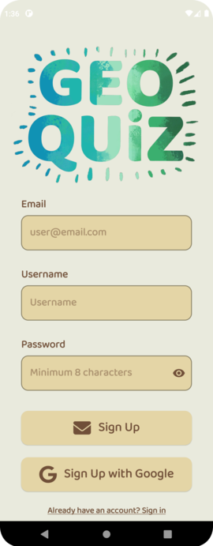
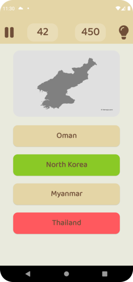

# Geo Quiz 
Geo Quiz is an android mobile app to test and enrich geography knowledge. 
It is developed in Java using Android Studio and Firebase. 
 
## Smooth Sign-in and Sign-up process. 
   
## Avaliable in both English and Arabic 
   
## Three different playing modes: Flag, Capital City, and Map 
    
## Answers Review 
    
## Track your progress and see highest ranked players 
   
## Light and Dark mode 
   
## Settings to customize your exprience. 
 
